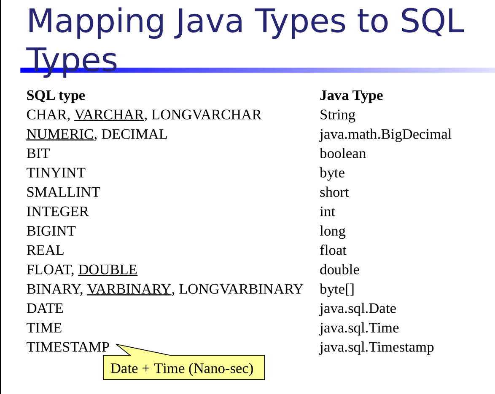
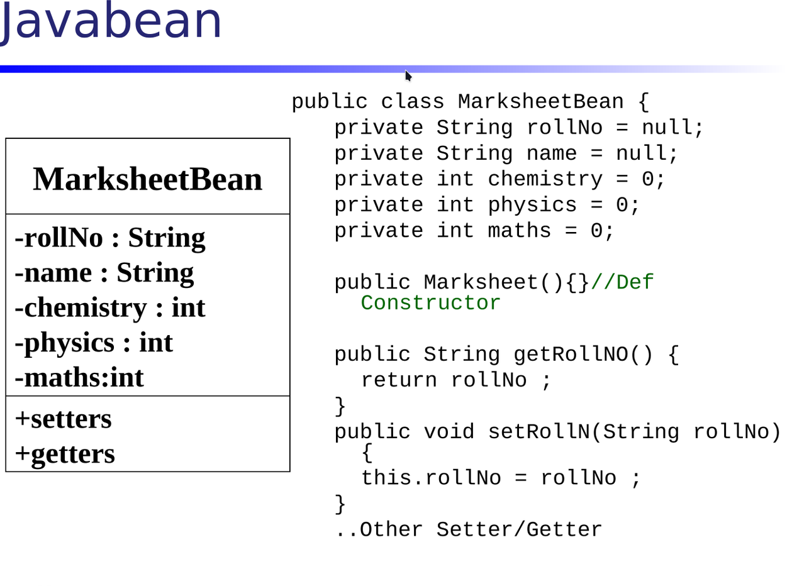

- [[Fri, 24.07.2026]]
  collapsed:: true
	- DONE jdbcConnection
	- JDBC -> Java Data Base Connectivity
	  collapsed:: true
		- queries will be run using java
		- Need Driver to connect database and java
		- java has all types of database driver found in maven repository
		  collapsed:: true
			- search _mysql connector/j_ and download 8.0.31 jar file.
				- jar file is external library of java.
				- to deploy an application we make a jar file
					- to use its functionality we need to integrate this jar file into our project
				- Inside the jar file _mysql connector/j_ there is mysql Driver
					- When we connect with database we need to use driver manager of driver.
					- driver manager and driver are of mysql. both should be of same database.
				- if you are using mysql you need to download mysql jar file
				-
				-
		- To connect to database java needs 2 lines of code
			- 1st of all we need to load the Driver
				- _Driver_ is a class in java
				- the jar file has package called `com.mysql.cj.jdbc`
					- that package has Driver class.
					- now we need to load this class in JVM.
						- so that java gets the driver of mysql so it can connect to database
						- java has its own _classloader_ in jvm
							- To load external class , so we use _classloader_ of java called `Class.forName()`
								- `Class` is a class having `forName` as method
								- pass the class you want to load inside classloader
									- for example here `com.mysql.cj.jdbc.Driver` including its package name
									-
								-
				- Now need to load the jar file in project
					- In java project there is an option for _classpath_ option
						- in _classpath_ we can add external library called jar file.
						- Right-Click on project > build path > libraries > classpath > add external jars > select mysql.jar
						- can see in _reference library_  `mysql-connector-j-8.0.31.jar`
				- in database we use `st-tablename` because table names like `user`, `condition` etc are reserved so we use standard prefix like `st_`
				- so to connect to database we need to go to _mysql_ , _demo database_, then in table.
			- 2nd we need Driver Manager of mysql
				- Driver Manager is also called **Factory of Connection**
				- **Factory design pattern** which provides object for another class/interface.
				  collapsed:: true
					- Driver Manager provides object of _Connection_ interface.
					- follows **Factory design pattern**
				- need 3 things:
					- port number of mysql
					- database name
					- username and password
				- Driver manager is predefined
					- imported from `java.sql`
					- having method `.getConnection()`
						- having 3 arguments -> _url_, *username*, *password*
						- returns Connection object which provides connection
						- the mysql is in localhost
							- `jdbc:mysql://localhost:port_no/dbname, username, password`
				- can print name of database which it connects `Connection.getCatalog()`
					- ### Exceptions
						- wrong database -> `UnknownDatabaseException` or `SQLSyntaxErrorException`
						- mysql service is down or hosts and/or port number is wrong -> `CommunicationsException`: Communications link failure
						- username or password is wrong -> `SQLException` access denied
						- wrong Driver class name / wrong jar file/ jar file not there -> `ClassNotFoundException`
						- wrong column names -> `UnknownColumnException`
				- hence connection made.
				- Now need to run queries
			- 3rd to run queries like `INSERT, UPDATE, DELETE and SELECT or SEARCH` use *Statement Interface*.
				- using it's method we can run queries
				- _Connection_ will give object to *Statement Interface*.
				- *Connection.createStatement()* provides object of Statement Interface and store it in Statement object. as its return type is Statement object
					- Connection is **Factory of Statement**
					- Statement has 2 methods:
						- `executeUpdate()`
							- It returns no. of rows
							- to run CREATE, INSERT, UPDATE, DELETE queries.
							- whatever query you run from it updates database
							- its return type is int
								- it returns integer values rows affected.
							- date format -> `year-month-day`
						- `executeQuery()`
							- to run SELECT or search query.
							- doesn't update databases.
			- [[Mon, 27.07.2026]]
				- DONE resultset
				- we can change port no. of mysql but at time of creation in 3rd step
				- 4th Result Set
					- **result set** contains data we searched using *SELECT* from database.
						- `st.executeQuery("select * from table_name")` returns result set
					- `rs.next()` -> iterates through records until record in result set gets empty
					- `result set.getInt()` for integer type
					- `getString()` for String type
					- `getDate()` for Date type
					- for searching two records use limit(0,2)
					-
					-
					-
- [[Mon, 27.07.2026]]
  collapsed:: true
	- Connecting with _mysql_ database
	- code:
		- ```java
		  - package com.rays.jdbc.modules.college;
		  - import java.sql.Connection;
		  - import java.sql.DriverManager;
		  - import java.sql.SQLException;
		  - public class CollegeInsert {
		  - public static void main(String[] args) throws ClassNotFoundException, SQLException{
		  - // 1. class loader ;  Connector/J -> official MySQL JDBC driver
		  - // throws a checked exception because Java cannot guarantee that the class exists at runtime.
		  Class.*forName*("com.mysql.cj.jdbc.Driver");
		  -
		  - //2. get connection
		  - // jdbc:mysql://localhost:3306/mydb
		  - //	│    │        │         │      │
		  - //	│    │        │         │      └── Database name
		  - //	│    │        │         └───────── Port number (3306 is MySQL's default)
		  - //	│    │        └─────────────────── Server/host
		  - //	│    └──────────────────────────── Database type (MySQL)
		  - //	└───────────────────────────────── JDBC protocol
		  - // Database server is not running.
		  - // Wrong username or password.
		  - // Incorrect database URL.
		  - // Database does not exist.
		  - Connection c = DriverManager.*getConnection*("jdbc:mysql://localhost:3306/modules", "root", "root");
		  ```
		-
- [[Tue, 28.07.2026]]
  collapsed:: true
	- # Transaction Handling
		- when we update, insert , delete then _transaction_ happens
		- can run multiple transactions at once
		- Having exception do rollback (revert)
		- Having no exception commit (save)
		- If we have done 4 transactions and one of them has exception and rest of them are committed then too rollback should occur and no change in database and no rows should be affected.
		- If all 4 of transactions having no exception then there must be changes in database as well as rows should be affected and commit should be done
		- ---
		- ## Definition
		  collapsed:: true
			- changes of this set is either committed together or rollback together in single attempt.
				- if no exception in that attempt occurs then commit data
				- otherwise all transaction must be rollback
			- Transaction Handling can only be done during update, delete and insert not in select.
			- Transaction handling done in following steps:
				- Made object of connection
				- `setautocommit` -> false
				- committed in try
				- rollback in catch
				- close connection in finally
		- by default statement does commit and rollback for ex. out of 4 transaction , 3 has exception then it rollbacks 3 and commit 1.
			- but manually we have to do rollback because if any one of the transaction got exception it must get rollback otherwise our data is not safe
			- `c.setAutoCommit(false);` so set this to false so that it doesn't auto commit or rollback
				- If exception occurs then rollback method will run otherwise commit method which will be done by us we should use these methods.
				- | Mode                          | Exception occurs |
				  | ----           | ----             | ----                   |
				  | `autoCommit=true`           | Previous successful statements stay committed |
				  | `autoCommit=false`   | You can catch the exception and call `rollback()` to undo all uncommitted statements |
				- <!--EndFragment-->
				-
				-
		- ### using try-catch
			- try has transactions.
				- committing done here
				- if any of them has exception execution flow goes to catch
			- catch has exceptions.
				- so if transaction has exception it rollbacks in catch
			- finally closes the connection
		-
		- #### Transaction Handling
			- transaction begins here:
				- `c.setAutoCommit(false);`
			- transaction commit
				- `conn.commit();` in try block
			- transaction ends:
				- `conn.close();`
				- in finally block
				- connection should always be closed otherwise mysql gets overloaded.
		- if you skipped rollback commit and `setautocommit` to true then one row get inserted out of 3 because 2nd one is duplicate of first one with unique primary key so row before that will be inserted and rest won't but if we didn't skip then transactions won't commit and get rollback
		- **3 transaction of insert should be written separately otherwise it won't work**
			- ##### Statement
				- for Statement every query is new query ; every query gets compiled every time you run it and values get changed
				- it is slow
			- ##### Prepared Statement
				- in this if you write a query it gets compiled once and runs repeatedly and changes values.
				-
			-
			-
		-
- [[Thu, 30.07.2026]]
  collapsed:: true
	- # Prepared Statement
		- ### Statement
			- in Statement query gets compiled each and every time
				- each query it takes as new query and gets compiled again and execute with new value
				- Query execution time slow
		- ### Prepared Statement
			- Query gets compiled once and run again and again with different values
			- Change the values in query
			- Fast execution time
				-
					-
			-
		- ### Code:
			- Earlier we use to create different class for table like insert , update, delete , create etc.
			- but now we will create a **model class** having all these as methods
				- classes which communicates with database are called *model class*
					- `public void add(int id, String firstname)` -> the id or firstname can be anything as they are obj.
					- Class Name -> TableNameModel
					- add queries of only one table otherwise it gets complicated
				- in class UserModel the date is of type `java.util` and in database date is of type `java.sql` convert util date to sql date
					- `new java.sql.Date(dob.getTime()))` converts to sql type
				- `prepareStatement()` is connection's method and write query inside it and store in `PreparedStatement obj`
					- import `java.sql.PreparedStatement`;
					- in `prepareStatement()` don't give values
					- Replace values with `?` as per no. of columns
					- `obj.setInt(parameterIndex means ?1,value to be stored ie firstName)` or setString or setDate
					- `int i = p.executeUpdate();` this inserts the data into database
					-
			- you can call add() using creating that class object and call using that obj function
				- in model.add(SimpleDateFormat -> Used to define a date format. and parse() Converts String to java.util.date)
				- ```
				  getTime()
				  - Returns milliseconds since 1 Jan 1970
				  
				  new java.sql.Date(ms)
				  - Creates a java.sql.Date object from those milliseconds
				  - Does not parse the date again
				  - Used by JDBC to store dates in a SQL DATE column
				  
				  Flow
				  java.util.Date → getTime() → milliseconds → java.sql.Date → Database
				  ```
				- ==45:16==
				-
				-
				-
- [[Fri, 31.07.2026]]
  collapsed:: true
	- ## Code
		- ### To avoid creating 16 columns in add method:
			- Create `bean` class with private attributes containing columns of table
				- Add `getters` and `setters` for `id` `firstName` etc.
				- `dob` will be of `java.util` type
			- and in add method remove all column names and add bean class object.
			- #+BEGIN_TIP
			  why we use add(Userbean bean) instead of (new Userbean())?
			  * Because the add() method is supposed to receive an existing object containing data, not create a new empty one.
			  #+END_TIP
			- collapsed:: true
			  ```java
			  pstmt.setInt(1, bean.getId());
			  ```
				- `setInt()` → Used to set an integer value.
				- `1` → Position of the first `?` in the SQL query.
				- `bean.getId()` → Retrieves the `id` value from the Bean object.
			- #### Bean Data Flow in JDBC
			  collapsed:: true
				- *DAO (Data Access Object)*
				  collapsed:: true
					- A class responsible for database operations.
						- Contains methods such as:
							- add()
							- update()
							- delete()
							- search()
							- findByPk()
							- Example:
								- UserModel
								- RoleModel
								- CollegeModel
								- ExamModel
				- *Purpose*
				  collapsed:: true
					- Data is first stored in the Bean object.
					- The Bean object is then passed to the DAO method.
					- The DAO method retrieves the data using getter methods and inserts it into the database.
				- *Step 1: Set data in Bean*
				  collapsed:: true
					- ```java
					  UserModel model = new UserModel();
					  UserBean bean = new UserBean();
					  bean.setId(9);
					  bean.setFirstName("Ayan");
					  bean.setLastName("Choudhary");
					  ```
					- Bean object now contains user data.
				- *Step 2: Pass Bean to DAO*
				  collapsed:: true
					- ```java
					  model.add(bean);
					  ```
					- The same Bean object is passed to the add() method.
				- *Step 3: Retrieve data in add()*
				  collapsed:: true
					- ```java
					  pstmt.setInt(1, bean.getId());
					  pstmt.setString(2, bean.getFirstName());
					  pstmt.setString(3, bean.getLastName());
					  ```
					- Getter methods retrieve values stored in the Bean.
					- PreparedStatement assigns these values to SQL parameters.
				- *Flow*
				  collapsed:: true
					- ```
					  testAdd()
					    ↓
					  bean.setXXX()
					    ↓
					  model.add(bean)
					    ↓
					  add(UserBean bean)
					    ↓
					  bean.getXXX()
					    ↓
					  PreparedStatement
					    ↓
					  Database
					  ```
				- *Key Point*
				  collapsed:: true
					- `setXXX()`
						- Stores data in the Bean object.
					- `getXXX()`
						- Retrieves data from the Bean object.
						- DAO methods receive a populated Bean object and use getter methods to access its data.
			- #### Date Handling in JDBC
			  collapsed:: true
				- ```
				  - Step 1
				    bean.setDob(sdf.parse("2004-10-09"));
				  - Input:
				        String -> "2004-10-09"
				  - Output:
				        java.util.Date
				  - Step 2
				    bean.getDob()
				  - Returns:
				        java.util.Date
				  - Example:
				        Wed Oct 09 00:00:00 IST 2004
				  - Step 3
				    bean.getDob().getTime()
				  - Returns:
				        Milliseconds since 1 Jan 1970
				  - Example:
				        1097251200000
				  - Step 4
				    new java.sql.Date(bean.getDob().getTime())
				  - Converts:
				        java.util.Date
				            ↓
				        java.sql.Date
				  - Output:
				        2004-10-09
				  - Step 5
				    pstmt.setDate(6, sqlDate)
				  - Stores date in database.
				  - Flow
				  - String
				        ↓ parse()
				    java.util.Date
				        ↓ getTime()
				    milliseconds
				        ↓
				    java.sql.Date
				        ↓
				    Database
				  ```
				- The main reason for this conversion is that `PreparedStatement.setDate()` expects a **`java.sql.Date`**, while your Bean stores the DOB as a **`java.util.Date`**.
			- #### executeUpdate()
			  collapsed:: true
				- Purpose
				    Executes INSERT, UPDATE, or DELETE statements.
				- Syntax
				    int i = pstmt.executeUpdate();
				- Return Value
				    Number of rows affected.
			- delete don't need bean as it only needs `id`
			-
		- ### To avoid loading drivers, making connection etc again and again
			- properties which do not change. Can be stored in a file
				- driver
				- url
				- password
				- username
				- ---
				- To use these properties we need `ResourceBundle` class imported from `java.util`
					- *ResourceBundle* is a Java class used to store and read properties value from a *properties file (`.properties`)*.
					- Create a bundle package
						- add `TestBundle.java` can be named anything
							- ```java
							  ResourceBundle rb = ResourceBundle.getBundle
							  ("com.rays.jdbc.bundle.system");
							  ```
								- Loads system.properties file from the package:`com.rays.jdbc.bundle`
								- Creates (or returns) a *ResourceBundle object* containing the key-value pairs
								- `"com.rays.jdbc.bundle.system"`
									- does not include *.properties* in the name. Java automatically appends .properties and loads system.properties.
							- Can retrieve property values using: `rb.getString("key")`
								- is case sensitive; `NotFoundException`
						- add `system.properties` -> anything instead of system
							- add the following:
								- ```
								  driver=com.mysql.cj.jdbc.Driver
								  url=jdbc:mysql://localhost:3306/demo
								  username=root
								  password=root
								  ```
							-
			- create a util package
				- add `JDBCDataSource` class
					- Without *JDBCDataSource* Every method must create its own database connection
					- we create this class to centralise database connection code so you don't have to repeat it in every method.
						- Create a public static method named `getConnection` that returns a `Connection` object and can be called without creating an object of the class.
							- **Why is Class.forName() not returned?**
								- `Class.forName("com.mysql.cj.jdbc.Driver");`
									- This loads and registers the MySQL JDBC driver with Java.
								- ```java
								  conn = DriverManager.getConnection(
								      rb.getString("url"),
								      rb.getString("username"),
								      rb.getString("password"));`
								  ```
								- Now Java uses the registered driver to create a database connection.
						- `conn = JDBCDataSource.getConnection();`
							- Call the `getConnection()` method and store the returned Connection object in conn.
					- we use utility class in util package because it will be reused repeatedly
				-
			-
- [[Mon, 03.08.2026]]
  collapsed:: true
	- # search methods
		- ## findByLogin
		  collapsed:: true
			- return type `userbean`
			- search one record
				- ### Code
				  collapsed:: true
					- same as pk
					- can use in inserting data.
					- you are going to add or insert a data where `loginId` is already present in database
						- so before adding data for ex. before try catch search using `bean.getLoginId()` and if data get searched then you can throws duplicate records found exception and if not searched add in the database.
							- to avoid duplicated records.
					- in the code:
						- `bean.getLoginId()` when we get id from main and in `findByLogin` that id got passed and query gets to run and if the records found then user bean object so we will store in user bean object `existBean`
							- if `existBean` is not null throw new exception _login already exists_
						- for ex.
							- in add method we set bean's id = 10 and loginId = "ayan@gmail.com"
							- that bean is being sent to model's add method.
							- so `UserBean existBean = findByLogin(bean.getLoginId());` so `ayan@gmail.com` gets passed here because login Id is string type `bean.setLoginId(rs.getString("loginId"));` from `findByLogin(String loginId)`
								- the `ayan@gmail.com` will be searched for in database and returns bean and we stored that in `existBean`
								- and this condition gets true:
									- ```java
									  if (existBean != null) {
									  			throw new RuntimeException("loginId already exists");
									  		}
									  // code gets stopped here. and data doesn't add.
									  // if use try catch the exception get handled and the code below it gets executed
									  // and database gets inserted hence duplicate records inserted :/
									  
									  ```
		- ## authenticate
		  collapsed:: true
			- return type `userbean`
				- reason why we use return type userbean
					- because it searches one record
				- ### Code
					- if one of them viz. login or password is wrong then access denied
					- 2 ways to write this method:
						- use same code written in `findbypk`
						- checks if database password or password sent by `findByLogin` and user written password in authenticate are same or not
							- `findByLogin(loginId);` we are sending loginId already using model's bean
								- search the record using `loginId` and in the record or row you get password too
									- then that password and the password which you get from here `authenticate(String loginId, String password)` are same then:
										- can login and returns bean
										- otherwise return null.
							- #### benefits:
								- no need to run query and other lengthy code
						-
		- ## findByPk
			- return type `userbean`
			- record not found exception
			- search one record
			- gets id, and all other fields; store in user bean object and return user bean object and print using sysout from bean
				- ### Code
				  collapsed:: true
					- name the method as per query
					- `select * from st_user where id = ?`
						- in the place of ? id will come from `findByPk(int id)`
						- for example we send id = 1 then query returns first row that row gets stored in result set further gets `set` in bean using while loop, additionally return that bean object
							- bean was null but now if it gets the row then it will get the memory and create the object
							- at first we used to print `rs.getInt("id")` instead of that we set it in bean
					- in test :
						- no need to create `UserModel`'s object everytime
							- instead make it static
							- can use this object in whole class and it is fixed now
							- don't make Bean as static because it' value keep on changing using setter and getters. so every-time it's object should be newly created
						- ```java
						  UserBean bean = new UserBean();
						  bean = model.findByPk(10);
						  ```
							- model's `findByPk()` returns bean the one we get from resultset hence need to be stored in newly created bean object.
							- so that we get row 1 which is set in bean
							- now need to print it but before that we need a condition what if bean is null
							- if bean is not null then print  using `bean.getId()` else throw runtime exception like record not found
								- can custom exception too
							- if id sent is 10 which is not available in record, then query will run but bean remain null and we get exception in main
							-
							-
						-
			-
		- ## search with pagination
		  collapsed:: true
			- return type `list`
				- reason:
				  collapsed:: true
					- searches whole records
					- multiple data stores in list
					- list can store multiple userbean object
				- generic `<userbean>`
			- database searched will be stored in bean
			- transaction handling won't be done here as no change in database.
	- Business Logic:
		- code that checks whether the data present in database
	- Data Access Logic
		- Code that communicates with the database to perform operations such as insert, update, delete, and search.
	- can create rollNo. in student and check if same rollNo. exists or not in add method if rollNo. found throw exception roll no already exists.
	-
- [[Tue, 04.08.2026]]
  collapsed:: true
	- # Mapping java types to sql types
	  collapsed:: true
		- Diagram
		  collapsed:: true
			- 
	- # Search Method with pagination
	  collapsed:: true
		- `findByPk` searches according to id so it's return type is userbean
		- but `search` searches for whole records so it's return type should be a list
		  collapsed:: true
			- hence the list should contain <UserBean> type generic
			- and return type is userbean list so that we can return multiple userbean type objects in a list at once
			- we will use `pageNo` and `pagesize` because here we will do search as well as pagination
				- page 1 first 5 records, page 2 next 5 records... likewise
			- `StringBuffer` ->mutable , as our query `"select * from st_user where 1=1 "` will get changed at runtime like appending `firstName` etc at end. like at at every page limit will be different for ex. at page 1 limit will be `0,5` then `5,5`
				- so String is immutable hence can't use that
				- we need to make it `String` type because `String` is needed in `preparedStatement`
			- `"select * from st_user where 1=1 "`
				- `1=1` is _SQL Injection_
					- when we append multiple queries like pagination queries at runtime then we need to give sql injection in form of 1=1 or it should be `true`
					- if we don't give _SQL Injection_ or it is like `1=2` the queries got appended because we used `StringBuffer` and it changed the value and appended pagination queries but won't run queries,
			- appending query
				- with condition `bean.getFirstName() != null && bean.getFirstName().length() > 0`
					- if bean is null then search will search full records
					- Uses:
						- these filters can be used in amazon like if i write asus laptops only products related to asus get searched.
			- `pageSize` -> means number of records on a page
				- ```java
				  int index = (pageNo - 1) * pageSize;
				  sql.append("limit " + index + ", " + pageSize);
				  ```
			- change the stringbuffer object to `.toString`
			- The while loop creates a new Bean object for each record fetched from the ResultSet.
				- getvalues from resultset and store it in bean
		- in main :
		  collapsed:: true
			- `List<UserBean> list = model.search(bean, 1, 5);`
				- model's search method will return list's object , list has bean object
				- `bean = it.next();`
					- `it.next()` gives bean object and stored in bean
					- here while loop will be better because in `forEach()` it takes object and print so need to use toString method
						- in userbean class
			- ```java
			  UserBean bean = new UserBean();
			  	//	bean.setFirstName("v");
			  List<UserBean> list = model.search(bean, 1, 5);
			  ```
				- in `model.search(bean` only null value is going inside so `if (bean != null)` will be false hence all records will get printed
				- all values like first name etc are null and pageno. is 1 and pagesize is 5
					- prints limit 0,5 and loop repeats for 5 times
						- creates new object stores values and added in list
	- ## Task
	  collapsed:: true
		- Diagram
		  collapsed:: true
			- 
		- in get give rollNo.
			- get merit list
				- merit marklist query p c m >=33 order by limit desc 0,10 search method return type list
			- return type list
				- no need to use stringbuffer because query is simple : order by limit desc 0,10
					- no need to use search filter , nor pagination
					- 10 records will come and loop will fetch record 10 times and reutrns list and print using iterator
					- use add update delete too
					-
			-
- [[Wed, 05-08-2026]]
	- # Resource Bundle
	  collapsed:: true
		- Supports multi-language applications ( ((6a802abc-5fd5-4f2c-9003-380a3c9b38cf)) )
		  collapsed:: true
			- i18n
			  id:: 6a802abc-5fd5-4f2c-9003-380a3c9b38cf
				- i + 18 letters + n [nternalizatio]
				- Enables multi-language support without code changes
					- for ex. application language can be changed to hindi
		- Removes hard-coded values using configuration files and read from resource bundle
		- Stores configurable parameters as key=value pairs
			- key value pairs is in `filename.properties`
				- to read that file need to use resource bundle object.
				- to make that
				  collapsed:: true
					- `ResourceBundle rb = ResourceBundle.getBundle("package_name.file_name");`
						- Loads the `ResourceBundle` file named `file_name` from the package `com.rays.jdbc.bundle`.
						- `getBundle()` searches for a properties file such as `system.properties`.
				- to read value from property file
					- `System.out.println(rb.getString("driver"));`
						- Prints the value associated with the key `driver` from the ResourceBundle.
						- It throws `MissingResourceException` if the key is not found.
				- to support hindi language in webapp.
					- `ResourceBundle rb = ResourceBundle.getBundle("com.rays.jdbc.bundle.app_hi", new Locale("hi"));`
						- `Locale` is a Java class that represents a specific language, region, and cultural settings.
						- if we don't pass `new locale` the default `en` will run.
						- **Layman Explanation**
						  collapsed:: true
							- A `Locale` tells Java:
								- Which language the user wants.
								- Which region's rules should be used.
						- `new Locale("hi")`
							- Creates a `Locale` object representing the Hindi language.
						- `rb.getString("greeting")` to get value of greeting
						-
		- **Where We Use It**
		  collapsed:: true
			- Database configuration.
			- Application settings.
			- Internationalization (i18n).
			- Externalized configuration files.
		- **Why We Use It**
		  collapsed:: true
			- To separate configuration from source code.
			- To make maintenance easier.
			- To support multiple languages and environments.
		- **Common Mistakes**
		  collapsed:: true
			- Using the file extension in `getBundle()`.
				- Wrong: `getBundle("system.properties")`
				- Correct: `getBundle("system")`
	- # JSP/Servlet
		- [[JSP]]
		- [[Servlet]]
		-
		-