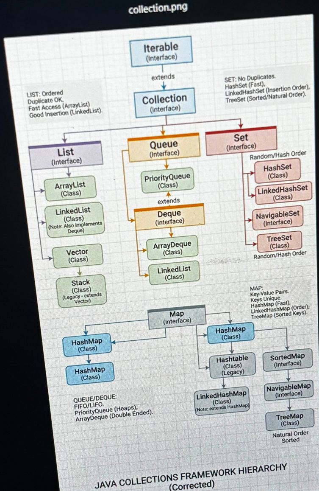
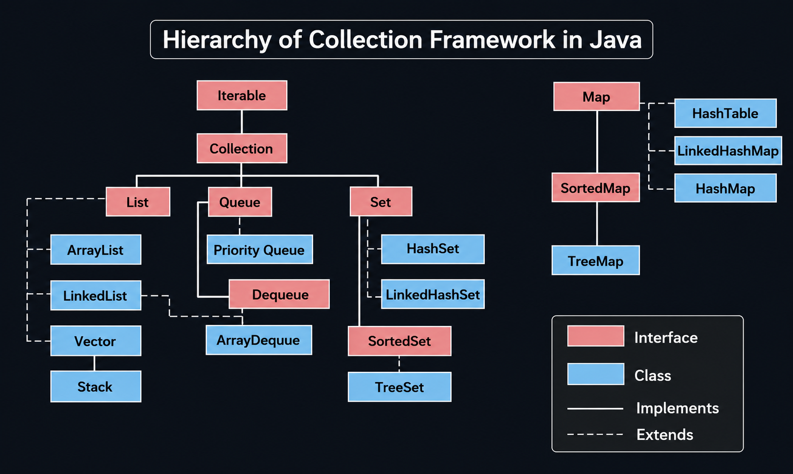

- [[Wed, 22.07.2026]]
  collapsed:: true
	- # Collection Framework
	  collapsed:: true
		- set of elements/data/values is called collection
		- Storing multiple different data
		- manipulating data -> update , delete etc.
		- ## Array vs collection
		  collapsed:: true
			- ### Array
				- collection of same type datatypes
				- for primitive datatypes
				-
			- ### collection
				- collection of objects like Integer, Boolean etc.
				- for objects
		- Collection can be of duplicate elements or unique elements
		- ### Ways to store data
		  collapsed:: true
			- #### stack memory
				- LIFO -> Last Store First Searched
				- book stacked upon each other ; book stored last is first searched
			- #### Queue memory
				- FIFO -> First Stored first Searched ;
				- booking tickets in queue
			- #### List memory
				- If want to search from middle
					- want to store in the middle then it is List memory
					- storing duplicate data.
			- #### Set memory
				- storing unique data
			- #### Map memory
				- key,value pair
				-
		- 
		-
- [[Thu, 23.07.2026]]
  collapsed:: true
	- Interfaces can inherit each other using _extends_ keyword
	-
	- Classes _implements_ interfaces
	- # Collection (I)
	  collapsed:: true
		- Collection is array of objects
		- Diagram:
			- collapsed:: true
				- 
				-
		- found in `java.util` package
			- ## List (I)  _extends_ Collection
				- Stores Null values
				- Stores duplicate values
				- Follows natural order
					- the order which you store in it ; you will get values in same order.
				- All following classes has properties of List like null values, duplicate and natural order.
				- ### ArrayList (Class)
					- Used for fast searching.
					- Slow insertion
				- ### LinkedList (Class)
					- Fast Insertion
					- Searching slow
				- ### Vector (Class)
					- Historical class or older class ; rarely used.
					- #### Stack (Class)
						- follows LIFO
							- elements stored last searched first.
			- ## Set (I)
				- Can store only one Null value.
				- ==Set doesn't have its own method.==
				- No duplicate
				- Sorted order.
				- ### HashSet (Class) _implements_ Set
					- Can store one Null value
					- Order is not decided
						- ascending or descending or whatever.
				- ### Sorted (Interface) _extends_ Set
					- #### TreeSet (Class) _implements_ Sorted
						- No null values allowed
							- Null value can't be sorted , hence it gets `null-pointer Exception`
						- Follows sorted order in ascending
			- ## Queue (I)
				- follows _FIFO_
				- can store duplicate and null values
				- ### Array Dequeue (C)
					- Any type of element can be stored here.
				- ### Priority Dequeue (C)
					- If first element is string ; then all the elements further stored will be string
					- If stored any other type of object then exception will occur
				- ### Dequeue (I)
					- Add first method
						- Insert element at first
					- Add last method
						- Insert element at last
		- Collection's method can be used by all three List , Set and Queue.
			- Due to encapsulation List, Set and Queue can't share/use their methods between themselves.
		- Collection can take reference of _ArrayList_,_LinkedList_, _vector_, _hashset_, _treeset_,_arraydeque_
			- Classes of List, Queue and Set are concrete classes(They override parent's behavior) of Collection as well as these 3.
				- Concrete class
					- ==Classes under Interface are concrete==
			- *Hashset hasn't overridden method of Set because Set doesn't have its methods.*
				- It has overridden method of Collection.
			-
		-
	- # Collection vs Arrays
	  collapsed:: true
		- ## Collection
			- keep storing the elements and size gets automatically increased.
		- ## Arrays
			- It has fixed size
	- # Methods
	  collapsed:: true
		- `add(o)` -> adds new element/value/object
		- `addAll(c)` -> adds collection.
		- `clear()` ->removes all elements from collection
		- `contains(o)` -> checks if object is present in collection
		- `containsAll(c)` -> checks if more than one object is present in collection.
		- `isEmpty()` -> Checks whether collection is empty or not
		- `remove(o)` -> removes object
		- `removeAll(c)` -> removes all objects from collection
		- `retainAll(c)` -> keeps/store same/duplicate element from 2 collections
		- `size()` -> checks how many elements are there in collection
		- `iterator()`-> to remove each value from collection
		- _methods having `All()` in their name is used wherever collections are more than 1_
	- Allows only Integer class for using integers not to be confused with primitive datatypes.
	- To print collection ; `system.out.println` c
	- "Orange" has different ASCII than "orange"
	-
- [[Fri, 24.07.2026]]
  collapsed:: true
	- # List
		- if we store first element on index 1 instead of 0 we get `IndexOutOfBoundException`
		  collapsed:: true
			- `l.add(1,1);`
			- `java.lang.IndexOutOfBoundsException: Index: 1, Size: 0`
			- Accessing unavailable index cause this.
		- In this we can add any object
		- collapsed:: true
		  ```java
		  l.add("Apple");
		  l.add(1,"Mango");
		  l.add(1,"Orange");
		  
		  // Output:
		  [Apple, Orange, Mango]
		  ```
			- mango shifted to next available index and orange comes to 1st.
		- List follows index sequence
		- `l.subList(0, 2)` prints last index - 1
		- if add had been removed then its index will be 0
			-
		- ## Array List and Linked List
		  collapsed:: true
			- ### Array List
				- _Why array list searching is fast?_
					- searching done on index using `get` and searched directly using ~get(index)~
						- if value stored on index 0, next element will be stored in index 1 i.e. next available index
					- this won't hold address. Only index based.
						- This will create address then stores hence insertion slow
						-
						-
			- ### Linked List
				- _Why insertion here is fast?_
					- Insertion is fast when address/reference is known beforehand
						- its also because 5th box will be placed after 4th that's why insertion fast.
							- 4th has address of 5th so 5th will directly be inserted after 4th
						- if you don't know address then to reach somewhere you will need time.
					- Here upcoming element's address already known to linked list
					- Indexing is here but having different address.
					- element stored on 0th index have its own address.
						- address of element stored on 1st index is with 0th index element
						- likewise for others
						- 7th index has its address stored in 6th, 6th has in 5th likewise up-to 0th
						  then linked list gives 7th index value after searching for this many addresses up-till 0.
						- *The element we are searching for has its address in its previous element.*
					-
				-
			-
			-
		- ## Vector
			- High memory usage.
			- Slow in performance
			- Instead of this we use `ArrayList` having low memory usage and fast
			- ### Array List vs Vector
				- | Vector | Array List |
				  | ---- | ---- | ---- |
				  | Synchronized->At a time only one user can work another has to wait for his turn | Asynchronized -> multiple users can access/work at a time|
				  |Vector is thread-safe|Nope|
				  | Performance slow| Performance high|
				  |Vector increase by double size |When an ArrayList becomes full, it expands its capacity by half of its current size. So a capacity of 2 increases by 1, resulting in a capacity of 3.|
				  |Consumes more memory | Consumes less|
				  |Legacy class| Introduced in java 1.2|
				  |used in Multi-user application| used in Single-user application|
				- Collection automatically increase the size as per insertion of elements
				- ==33:09==
				-
- [[Mon, 27.07.2026]]
  collapsed:: true
	- DONE iterator
	- # Iterator
	  collapsed:: true
		- To take each element from collection one by one.
		- It is an interface.
		- Use:
		  collapsed:: true
			- because in for each we can't remove objects. but here we can.
			- 3 methods:
				- `hasNext()` return type boolean
					- checks if element is there in collection or not ; if it returns true then only next method will run
					- if collection is empty `hasNext()` returns false and loop ends.
				- `next()` return type object; prints the element.
				- `remove()` void return type; if no need of that object then remove the object.; It is optional.
			- ==They will be executed in sequence.==
				- if you want to run `remove()` before `next()` that will raise exception.
					- `IllegalStateException`
					- without showing t-shirt how can you sell the t-shirt.
			- example
				- shopkeeper has collection of clothes ; buyer came and demanded for red colour t-shirt. (hasNext method to search for red shirt) . If present then he will show ( next() method to show) . if buyer want to buy tshirt ( then use remove to get the tshirt and remove from collection)
					- `Remove()` removes the element and freeing up memory, in future you can add more elements in collection
		- `list.iterator()` -> provides you object of iterator so that you can store it in object of iterator `Iterator i`
			- iterator() is predefined call this and you get its object
			- Collection has iterator()
		- list is a collection and list can call collection method and it gives object of iterator interface.
		- while loop to check next element is present in collection or not `i.hasNext()`
		- `i.next` prints the element in collection
		- to remove one element we will use `if (i.next.equals(iterator)` then remove that element from list
	- # Enumeration
	  collapsed:: true
		- it does not have remove method
			- if you enumeration the list won't be empty ever.
		- checks next element and prints.
		- It is historical
			- it can be used historical classes like vector, stack not _ArrayList_
		- can't release memory
		- Methods:
			- it has `hasMoreElements` method which checks whether the next element is present or not
				- returns boolean
			- `nextElement()` for printing
				- returns object
		- Just like we use `iterator` for creating object of iterator, for enumeration we use `elements()` of vector can store in Enumeration object as its return type is Enumeration.
		-
		-
		-
		-
	- # Difference #interview
	  collapsed:: true
		- | Enumeration | Iterator |
		  |-------------|----------|
		  |     can be used with only historical collection        | can be used with all collection including historical        |
		  |             |          |
		  |  has 2 important methods (desc them)          |   has 3 important method       |
		  |             |          |
		  |       it can't      |   iterator can remove elements from collection       |
		  |             |          |
		  |     fail-safe(can add more in list after object creation        |     fail-fast (can't add more in list after object creation) if done forcefully it will cause `ConcurrentModificationException`    |
		  |             |          |
		  |             |          |
		  |             |          |
	- # Sorting
	  collapsed:: true
		- `Collections.sort(list)` pass list object
			- Collections is class.
			- It has static methods.
			- found in `java.util`
			- sorted in ascending order.
			-
	- # Shuffle
	  collapsed:: true
		- `Collections.shuffle(list)` pass list object
			- gives random order on each run.
	- # Reverse Order
	  collapsed:: true
		- Didn't tell what it is.
- [[Tue, 28.07.2026]]
	- DONE customList
	- # Custom list
	  collapsed:: true
		- In parameterized constructor , if you don't want to create getters then use
			- `.toString()` it converts objects to string
				- Object's class( Parent of all classes) method
				- override it
				- return type *String*
				- if attribute is int then too it converts it to string because we have appended it to string #interview
				  collapsed:: true
					- `"name" + name + " roll "+ roll`
					- whatever gets appended to string becomes string
					-
				- no need to create `getters` like getRollNo() etc. now only toString()
				- To run it in main method call Student `st.toString()` or `st` is enough by default it will be st.toString()
					- as we have overridden method of parent Object class in Child Student class, the method of child class will be called
				- with `.toString()` we don't need to use `System.out.println(obj.getName())` and others.
				- If there are 500 objects you need to create that many `sysout`
					- To avoid that we store it in list.
					- List is a collection and can store any type of object.
		- ## Creating custom list
		  collapsed:: true
			- Can Store specific type of object like Student class.
				- In `List <Student> l = new ArrayList <>();`
					- <Student> type of object can be stored in List not any other type
						- It is called `generic`
							- if type is defined of Collection we use generic
							- while creating object we use generic
							- denoted with `<>`
						- `l.add()` now can store only Student type object
			- ### To print list objects:
				- Using for-each loop
					- Now if u run for-each loop then instead of `Object o` u need to provide `Student type objects`
				- Using iterator
					- Iterator type will be Student too because when u iterate through list the type of list is Student
					- as `Next()` return type is object but i is of return type Student so need to store in Student object.
				- Using *forEach()*
					- Introduced in _Java 8.0_
					- It iterates all values of collection in one line.
						- `list.forEach(System.out::println)`
						- can be called from collection
						- list is collection
						- no need to tell which type of object is there in list
						- It will print one by one
						- Most used
					-
					-
			-
			-
	- # Sorting
		- in  `"Ram",21,"maths"`
		  collapsed:: true
			- sort method will get confused which one to sort ascending order
			- so it won't work gets error
			- list having 3 attributes on which basis it has to sort
			- For that we need to tell which attribute need to be sorted
		- Need 2 interfaces to solve which attribute need to be sorted:
		  collapsed:: true
			- ## Comparable
				- in `java.lang` package
				- abstract method -> `compareTo()`
				- sorts unique type attributes
				- unique type ke attributes se sort karne ke liye use hota
				-
					-
			- ## Comparator
				- in `java.util` package
				- abstract method -> `compare()`
				- sorts any type of attributes.
				- kisi type ke attributes se sort karne ke liye use hota
				-
					-
			- Using these 2 you can tell sort method which attribute will be sorted.
			- ---
		- [[Wed, 29.07.2026]]
			- How to create a _filter_ in an application
				- #+BEGIN_EXAMPLE
				  in amazon etc.
				  sorting by price -> attribute
				  by category -> attribute etc.
				  in ascending or descending
				  #+END_EXAMPLE
				- ## Comparable
				  collapsed:: true
					- is interfaces
						- need to `implement` that which in return provides method
						- in that method write Which attribute should be used for sorting?
					- column must be unique
					- Two ways to write code:
						- can use setter getter and can use .toString() for direct obj printing
						- can use .toString() and parameterized constructor
							- #shortcut Eclipse Source > Generate constructor using fields or Generate toSting()
					- `Collections.sort(l);`
					  collapsed:: true
						- it will have error because it is getting marksheet's object in the list l
							- marksheet has 3 attributes , now sort is confused which one is need to be used for sorting.
								- To allow sorting Marksheet class must implement Comparable interface otherwise sorting not possible
									- need to give generic of same class to Comparable because if you override the abstract method then you will get marksheet object.
									- `public interface Comparable<T> `
										- interface
										- T is generic type parameter represents class
										- `public int compareTo(T o);`
											- abstract method
											- o is an object of type t
											- o is second object.
											- Method Used to compare the current object (this) with another object (o) after gets overridden
												- return type is int
												- so to convert double to int we use type casting
												  collapsed:: true
													- ```java
													  return (int) (this.double - o.double); 
													  ```
											- if method by default returns
											  collapsed:: true
												- 0 -> no sorting --> Both objects are equal. means value are same for ex. `this.name = "Ravi";o.name = "Ravi";`
												- 1 -> ascending --> place this after o
												- -1 -> descending order sorting --> this object should come before o
											- `this` -> Class's first object.
											- `o` -> Class's 2nd object.
											- if attribute is `String` type then can't use `-` instead
												- this.attribute can call String method
												- `this.attribute.compareTo(o.attirubute)` returns int
												- Ascii value of `lowercase` > `uppercase`
											- At a time only one value will be returned
									-
										-
										-
					- ### Issue with comparable
						- can use any one attribute at once
						- one of the attribute must be unique
							- if duplicate then won't see sorting
							-
					-
					-
				- ## Comparator
					- Most used
					- At a time any one attribute can be used for sorting
					- One class can have multiple comparator
					  id:: 6a6acebc-a713-4969-b0b7-f36e4581d92e
						- No. of comparator depends on no. of attributes based on which sorting will be done
						- for ex
							- 3 attributes can have 6 comparators
								- name -> orderbyname asc, orderbyname desc
					- Contains `compare` abstract method
						- `public interface Comparator<T>`
							- `int compare(T o1, T o2);`
								- gets to compare 2 objects of class
					- code:
						- make attribute public
							- if you make them private then need to create getter methods for ex. in  another class we need to use `o1.getProductPrice`
							- its comparator will be created in another class
								- because ((6a6acebc-a713-4969-b0b7-f36e4581d92e))
								- so to access those comparators making attribute public
						- Comparator won't implement in class where we are giving attirbutes
							- those will implemented in another class filters
						- so in main we can pass both collection object as well as comparator object in collections sorting
							-
						- ==52:17==
					- **Rephrased Note**
						- Comparator
							- Most commonly used
							- At a time, one attribute can be used for sorting
							- One class can have multiple comparators
								- The number of comparators depends on the attributes used for sorting
								- For example
									- 3 attributes can have 6 comparators
										- name → order by name ascending, order by name descending
							- Contains the `compare` abstract method
								- `public interface Comparator`
									- `int compare(T o1, T o2);`
										- Used to compare two objects of a class
							- Code
								- Make the attribute public
									- If the attribute is private, getter methods are needed
									- For example, in another class we need to use `o1.getProductPrice`
									- The comparator is created in another class
										- Because one class can have multiple comparators
										- So the attribute is made public to access it
								- Comparator is not implemented in the class where the attributes are defined
									- It is implemented in another class, such as a filter class
								- In `main`, we can pass both the collection object and the comparator object to collection sorting
						- **Notes Enhancement**
							- A `Comparator` is used to define custom sorting logic for objects.
							- A comparator can be used to sort the same class in different ways.
							- The `compare()` method compares two objects and decides their order.
								- Negative value → first object comes before second object
								- Zero → both objects are considered equal for sorting
								- Positive value → first object comes after second object
							- `Comparator` is useful when the class can have more than one possible sorting order.
							- A comparator can be passed to sorting methods such as `Collections.sort()` and `List.sort()`.
							- The attribute does not need to be public just because a comparator is in another class.
								- A private attribute can be accessed through a getter method.
								- Keeping fields private is generally better for encapsulation.
						- **Explanation by GPT**
							- Definition
								- `Comparator` is an interface used to define custom sorting rules for objects.
							- Syntax / Structure
								- `public interface Comparator<T>`
								- `int compare(T o1, T o2);`
							- Layman Explanation
								- Comparator tells Java how two objects should be compared when sorting.
								- For example, products can be sorted by price, name, or id.
							- Why We Use It
								- We use it when we want different ways to sort objects of the same class.
							- Where We Use It
								- It is commonly used with collections such as `List`.
								- It is useful when objects need custom sorting.
							- When Not to Use It
								- If the class already has one natural sorting order and `Comparable` is enough, a separate `Comparator` may not be needed.
							- How It Works
								- A comparator receives two objects.
								- The `compare()` method compares them.
								- The sorting method uses the result to arrange the objects.
							- Example
								- A `Product` class can have different comparators.
									- One comparator can sort by name.
									- Another can sort by price.
									- Another can sort by id.
							- Real World Example
								- An online store can show products sorted by price, name, rating, or popularity.
							- Interview Point
								- `Comparator` allows multiple sorting orders for the same class.
								- Its main method is `compare(T o1, T o2)`.
							- Common Mistakes
								- Confusing `Comparator` with `Comparable`.
								- Thinking that fields must be public for a comparator to access them.
									- Private fields can be accessed through getter methods.
								- Forgetting to return the correct comparison result from `compare()`.
							- GPT Summary
								- `Comparator` is used when we need custom or multiple sorting orders for objects.
								- It compares two objects using `compare()` and gives the sorting logic to the collection.
					-
						-