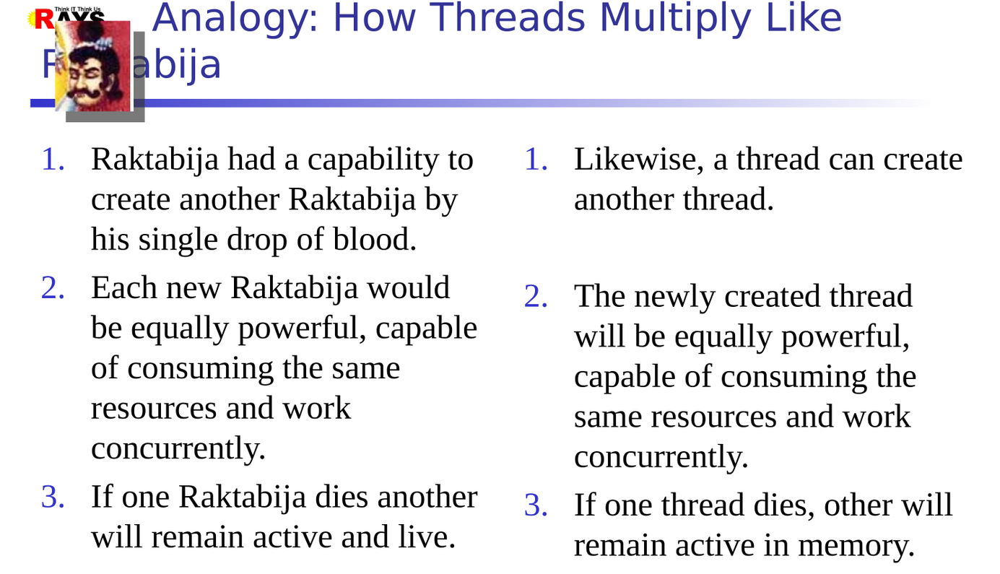
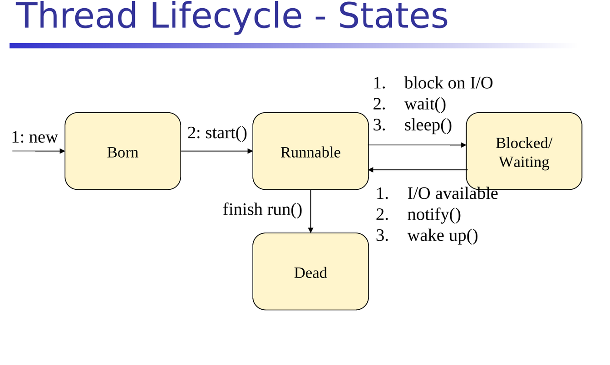
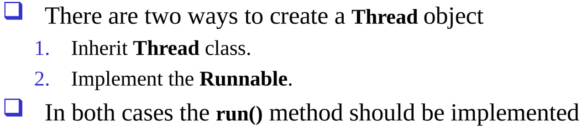

- [[Tue, 04.08.2026]]
	- threads
		- CPU Scheduler
			- The thread that gets the CPU cycle will execute its work.
		- diagram Analogy How threads multiply like raktabij
		  collapsed:: true
			- 
		- Diagram Life cycle of threads
		  collapsed:: true
			- 
			-
			- after run it can temporarily sleep or terminate or gets blocked
			- born -> start -> run -> sleep/terminate/waiting or blocked otherwise dead
		- 2 ways to create threads
		  collapsed:: true
			- diag
				- 
		- OS Scheduling
		  collapsed:: true
			- The OS allocates CPU time to threads.
			- Threads with higher priority are more likely to run first.
			- Priority ranges from 1 to 10, where 10 is the highest.
			-
		- code:
			- ```java
			  
			  public class HelloThread extends Thread {
			  
			  	private String name;
			  
			  	public HelloThread(String name) { //hellothread is constr.
			  		this.name = name;
			  	}
			  
			  	@Override
			  	public void run() { 
			  		for (int i = 1; i <= 10; i++) {
			  			try {
			  				Thread.sleep(1000);
			  			} catch (InterruptedException e) {
			  				// TODO Auto-generated catch block
			  				e.printStackTrace();
			  			}
			  			System.out.println(i + " = " + name);
			  		}
			  	}
			  }
			  
			  package com.rays.thread;
			  
			  public class TestHelloThread {
			  
			  	public static void main(String[] args) {
			  
			  		// thread are born when create object using new keyword
			  		HelloThread t1 = new HelloThread("Ram");
			  		HelloThread t2 = new HelloThread("Shyam");
			  
			  		// thread start when call start() method(start method call run method)
			  		t1.start();
			  		t2.start();
			  
			  		for (int i = 1; i <= 5; i++) {
			  			System.out.println(i + " = " + "Akbar");
			  		}
			  
			  	}
			  
			  }
			  ```
		- which ever thread goes to cpu first its object gets printed.
		-