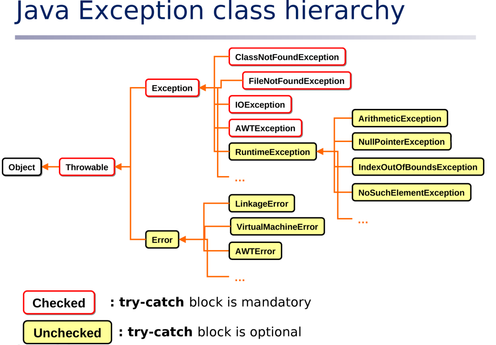

- [[Tue, 21.07.2026]]
  collapsed:: true
	- DONE Exception
	- # Exception Handling
		- Can't handle error
		- Can handle exceptions
		  collapsed:: true
			- Exception:
				- Abnormal condition which terminates program
				- provides wrong execution/answer
					- we must know where the execution is wrong so that we can handle that exception
		- Makes the program reliable
		- For ex.
		  collapsed:: true
			- if a String object does not have any value and we are running methods like uppercase, lowercase etc. then it will raise `NullPointerException`
			- similarly `indexOutOfBoundsException` whenever we need to access more than index assigned to an array.
		- ### Two types of Exception:
			- #### Compile time
			  collapsed:: true
				- While writing code
				- example
				  collapsed:: true
					- If it is raining outside then use raincoat
				- so here we know about exception beforehand
				- handling compile time exception is mandatory
				- _Checked_
				  collapsed:: true
					- Rain can be seen and it is raining
					- `try-catch` block is mandatory
						- Used to handle exception
				- **Exception Class**
					- `ClassNotFoundException`
					- `FileNotFoundException`
					- `IOException`
					- `AWTException`
					-
			- #### Run time
			  collapsed:: true
				- When we run the code on console
				  collapsed:: true
					- example
						- The weather feels like it can rain today but it isn't raining ; now wearing raincoat is optional
				- _Unchecked_
				  collapsed:: true
					- Not raining but can rain
					- `try-catch` optional
					-
				- **Exception Class**
					- RuntimeException
						- `ArithmeticException`
							- When divide by 0
						- `NullPointerException`
						- `IndexOutOfBoundException`
						- `NoSuchElementException`
			- Hierarchy #interview
			  collapsed:: true
				- 
				-
		- To handle exception
			- we use try-catch:
				- Try:
					- if try gets exception
				- Catch:
					- then it will handle it
					- need to create object of the type of Exception in `catch`.
					  collapsed:: true
						- ```java
						  catch(ExceptionName obj){
						    System.out.println(obj.getMessage());
						  }
						  ```
						- `getMessage()` predefined method of Exception to give message of Exception
						- `printStackTrace()` -> prints exact Exception , where it is on which line number.
						-
					- can use more than one catch for handling different exceptions
						- for ex. null pointer and index out of bound
					- For multiple catch:
						- for example : try has 100 lines of code
							- then to avoid lengthiness use `Exception`
								- `Exception e`
								- to handle all exceptions
								- called as ==Parent catch block==  to handle all exceptions
								-
- [[Wed, 22.07.2026]]
  collapsed:: true
	- # Custom Exception
		- Can make both checked and unchecked
		- To raise custom exception we use keyword `throw`
		- ## Reason to make custom exception
		  collapsed:: true
			- #+BEGIN_EXAMPLE
			  Ex.
			  - You made an account class having withdraw method
			    - if withdraw amount is greater than balance
			    - raise exception `InsufficientFundsException`
			    - need to make this class by inheriting `runtime exception` or `exception`as well raise  this exception ourselves.
			  
			  Ex2.
			  - You made login_id value `admin`
			    - if user wrote `admin` then he can login but if not then `loginException` should be raised
			  
			  Ex3.
			  - If i need to store some value in database
			    - i don't want to store duplicate values 
			    - then i need to raise `DuplicateRecordException`
			  
			  - If i am searching for a record and not getting it 
			    - then i need to raise `RecordNotFoundException`
			  
			  
			  #+END_EXAMPLE
			- We make custom defined exception because it is not predefined, according to our needs and condition of program  we make these.
			- To make runtime exception extend runtime exception class, likewise for compile time exception extend Exception class.
			-
			-
			-
		- In runtime try-catch is optional
		- ---
		- ## Propagates
		  collapsed:: true
			- When you don't want to handle exception then `propagate` it.
				- **Exception always goes back to the immediate caller first.**
					- If that caller does not handle it, it keeps moving upward in the call stack.
				- `propagate` means do not handle exception or not to use try-catch.
					- #+BEGIN_EXAMPLE
					  Family Exception Propagation Analogy
					  
					  Husband gives wife Rs. 500 to buy groceries.
					  Wife gives the Rs. 500 to the child and asks the child to buy the groceries.
					  The child loses the money. This is the exception.
					  
					  Case 1: Child handles the exception
					  
					  The child has another Rs. 500 saved.
					  The child uses their own money and buys the groceries.
					  The exception is handled, so it does not propagate.
					  
					  Case 2: Child cannot handle it
					  
					  The child has no extra money.
					  The child informs the wife.
					  The exception propagates to the wife.
					  
					  Case 3: Wife handles it
					  
					  The wife has another Rs. 500.
					  She gives it to the child (or buys the groceries herself).
					  The exception is handled.
					  
					  Case 4: Wife cannot handle it
					  
					  The wife also has no extra money or chooses not to deal with it.
					  She informs the husband.
					  The exception propagates to the husband.
					  
					  Case 5: Husband handles it
					  
					  The husband provides another Rs. 500.
					  The groceries are bought.
					  The exception is finally handled.
					  ---
					  | Analogy                   | Java                                               |
					  | ------------------------- | ----------------------------|
					  | Child loses the money     | Exception occurs                                   |
					  | Child fixes the problem   | `try-catch` in child method                        |
					  | Child informs wife        | Exception propagates to caller                     |
					  | Wife fixes the problem    | Caller catches the exception                       |
					  | Wife informs husband      | Exception propagates further                       |
					  | Husband fixes the problem | `main()` catches the exception                     |
					  | Nobody can fix it            | JVM handles it (prints stack trace and terminates) |
					  
					  #+END_EXAMPLE
				- `throws` keyword for propagation
				- it works in `checked` exception or compile time exception
					- in runtime , try-catch is optional but in checked it's mandatory.
					- runtime automatically gets propagated.
		- ## Finally
		  collapsed:: true
			- It is optional
			- If exception comes then and if exception gets handled then and exception does not come then too the finally will be executed eventually
				- #+BEGIN_EXAMPLE
				  E1
				  if you locked the door father still checks the lock so this activity runs whether you lock the door or not
				  E2
				  if you open the file and you want to read a file in that folder and the file is not there then you will close the folder ; closing the folder no matter what is written in finally block.
				  #+END_EXAMPLE
				- Resource releasing codes are written in finally block
		- ## Finally vs Final vs Finalised
		  collapsed:: true
			- ### Finalised method
				- It is method of garbage collector
				- it runs internally not by user.
				- constructor provides memory; finalise destroys the object which is not used; in java garbage collector does the memory management
			- Final
				- Keyword
				- make constants
				- If you want to provide general behaviour make method `final`
			- Finally
				- block